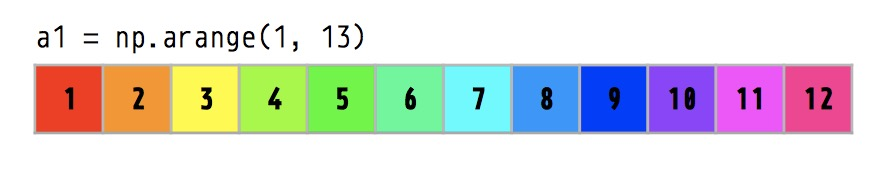
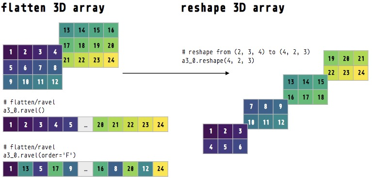

```{r setup, include=FALSE}
knitr::opts_chunk$set(echo = TRUE, cache = FALSE, comment = NA, message = FALSE, warning = FALSE)
```

Get source code for this RMarkdown script [here](https://github.com/hauselin/rtutorialsite/blob/master/_posts/2019-12-20-numpy-reshape/numpy-reshape.Rmd). Download the cheatsheet [here](https://github.com/hauselin/rtutorialsite/blob/master/_posts/2019-12-20-numpy-reshape/reshape.pdf).

This tutorial is also available on [Medium, Towards Data Science](https://towardsdatascience.com/reshaping-numpy-arrays-in-python-a-step-by-step-pictorial-tutorial-aed5f471cf0b?source=friends_link&sk=3dc229066e89cb5bcd4bb86b301f0a5c).

## Consider being a patron and supporting my work?

[Donate and become a patron](https://donorbox.org/support-my-teaching): If you find value in what I do and have learned something from my site, please consider becoming a patron. It takes me many hours to research, learn, and put together tutorials. Your support really matters.

How does the numpy `reshape()` method reshape arrays? Have you struggled understanding how it works or have you ever been confused? This tutorial will walk you through reshaping in numpy. 

## Use reticulate R package to run Python in R

```{r}
library(reticulate)
use_condaenv(condaenv = "python376", conda = "/opt/anaconda3/bin/conda") # python environment
```

## Create a Python numpy array

Use `np.arange()` to generate a numpy array containing a sequence of numbers from 1 to 12. See documentation [here](https://docs.scipy.org/doc/numpy/reference/generated/numpy.arange.html).

```{python}
import numpy as np

a1 = np.arange(1, 13)  # numbers 1 to 12
print(a1.shape)
print(a1)
```



## Reshape with `reshape()` method 

Use `reshape()` method to reshape our `a1` array to a 3 by 4 dimensional array. Let's use **3_4** to refer to it dimensions: 3 is the 0th dimension (axis) and 4 is the 1st dimension (axis) (note that Python indexing begins at 0). See documentation [here](https://docs.scipy.org/doc/numpy/reference/generated/numpy.reshape.html). 

```{python}
a1_2d = a1.reshape(3, 4)  # 3_4
print(a1_2d.shape)
print(a1_2d)
```


If you want numpy to automatically determine what size/length a particular dimension should be, specify the dimension as -1 for that dimension.

```{python}
a1.reshape(3, 4)
a1.reshape(-1, 4)  # same as above: a1.reshape(3, 4)

a1.reshape(3, 4)
a1.reshape(3, -1)  # same as above: a1.reshape(3, 4)

a1.reshape(2, 6)
a1.reshape(2, -1)  # same as above: a1.reshape(2, 6)
```

## Reshape along different dimensions

By default, `reshape()` reshapes the array **along the 0th dimension (row)**. This behavior can be changed via the `order='C'` parameter (default value is `'C'`). See [documentation](https://docs.scipy.org/doc/numpy/reference/generated/numpy.reshape.html) for more information.

```{python}
a1.reshape(3, 4)  # reshapes or 'fills in' row by row
a1.reshape(3, 4, order='C')  # same as above because default order='C'
```

We can reshape **along the 1st dimension (column)** by specifying `order='F'`. For those familiar with MATLAB, MATLAB uses `order='F'`.

```{python}
a1.reshape(3, 4, order='F')  # reshapes of 'fills in' column by column
```


Test: `a1` is a 1D array—it has only 1 dimension, even though you might think it's dimension should be 1_12 (1 row by 12 columns). To convert to a 1_12 array, use reshape.

```{python}
print(a1)
print(a1.shape)  # just (12,)

a1_1_by_12 = a1.reshape(1, -1)
print(a1_1_by_12)  # note the double square brackets!
print(a1_1_by_12.shape)  # 1_12 array
``` 

## Flatten/ravel to 1D arrays with ravel()

The `ravel()` method lets you convert multi-dimensional arrays to 1D arrays (see docs [here](https://docs.scipy.org/doc/numpy/reference/generated/numpy.ravel.html)). Our 2D array (3_4) will be flattened or raveled such that they become a 1D array with 12 elements. 

If you don't specify any parameters, ravel() will flatten/ravel our 2D array along the rows (0th dimension/axis). That is, row 0 [1, 2, 3, 4] + row 1 [5, 6, 7, 8] + row 2 [9, 10, 11, 12].

If you want to flatten/ravel along the columns (1st dimension), use the order parameter.

```{python}
print(a1_2d)  # 3_4
print(a1_2d.ravel())  # ravel by row (default order='C')
print(a1_2d.ravel(order='F'))  # ravel by column
```

## Concatenate/stack arrays with `np.stack()` and `np.hstack()`


Create two 1D arrays

```{python}
a1 = np.arange(1, 13)
print(a1)
a2 = np.arange(13, 25)
print(a2)
```

Use `np.stack()` to concatenate/stack arrays

By default, `np.stack()` stacks arrays along the 0th dimension (rows) (parameter `axis=0`). See [docs](https://docs.scipy.org/doc/numpy/reference/generated/numpy.stack.html) for more info.

```{python}
stack0 = np.stack((a1, a1, a2, a2))  # default stack along 0th dimension/axis (row)
print(stack0.shape)
print(stack0)
```

Stack along the 1st dimension (`axis=1`)

```{python}
stack1 = np.stack((a1, a1, a2, a2), axis=1)
print(stack1.shape)
print(stack1)  
```

Concatenate as a long 1D array with `np.hstack()` (stack horizontally)

```{python}
stack_long = np.hstack((a1, a2))
print(stack_long.shape)
print(stack_long)  
```

## Create multi-dimensional array (3D)

Create two different 3 by 4 arrays.

```{python}
a1 = np.arange(1, 13).reshape(3, -1)  # 3_4
print(a1)
a2 = np.arange(13, 25).reshape(3, -1)  # 3_4
print(a2)
```


### Create a 3D array by stacking the arrays along different axes/dimensions

```{python}
a3_0 = np.stack((a1, a2))  # default axis=0 (dimension 0)
a3_1 = np.stack((a1, a2), axis=1)  # dimension 1
a3_2 = np.stack((a1, a2), axis=2)  # dimension 2
```

Inspect the 3D arrays. Note the three 3D arrays have different shapes.

```{python}
print(a3_0.ndim)  # number of dimension
print(a3_0.size)  # number of elements in array
print(a3_0.shape)  # 2_3_4
print(a3_0)
print(a3_1.shape)  # 3_2_4
print(a3_1)
print(a3_2.shape)  # 3_4_2
print(a3_2)
```


Because the three 3D arrays have been created by stacking two arrays along different dimensions, if we want to retrieve the original two arrays from these 3D arrays, we'll have to subset along the correct dimension/axis.

Reminder of what `a1` array looks like before we retrieve it from our 3D arrays.

```{python}
print(a1)  # reminder of what a1 is
```

Retrieve `a1` from 0th dimension. Note the 

```{python}
print(a3_0.shape)
print(a3_0)
print(a3_0[0, :, :])  # idx 0 along 0th dimension
a3_0[0]  # same as above
```

Retrieve `a1` from 1st dimension

```{python}
print(a3_1.shape)
print(a3_1)
print(a3_1[:, 0, :])  # idx 0 along 1st dimension
```

Retrieve `a1` from 2nd dimension

```{python}
print(a3_2.shape)
print(a3_2)
print(a3_2[:, :, 0])  # idx 0 along 2nd dimension
```

## Flatten multidimensional arrays

We can also flatten multi-dimensional arrays with `ravel()`.



Ravel row by row (default `order='C'`) to 1D array

```{python}
print(a3_0)
print(a3_0.ravel())
```

Ravel column by column  (`order='F'`) to 1D array

```{python}
print(a3_0)
print(a3_0.ravel(order='F'))
```

## Reshape multidimensional arrays

We can also use `reshape()` to reshape multi-dimensional arrays.

Reshape row by row (default `order='C'`) to 2D array

```{python}
print(a3_0)  # 2_3_4
print(a3_0.reshape(4, -1))  # reshape to 4_6 (row by row)
```

Reshape row by row (`order=F`) to 2D array

```{python}
print(a3_0.reshape(4, -1, order='F'))  # reshape to 4_6 (column by column)
```

Reshape row by row (default `order='C'`) to 3D array

```{python}
print(a3_0)  # 2_3_4
print(a3_0.reshape(4, 2, 3))  # reshape to 4_2_3 (row by row)
```

## Support my work

[Support my work and become a patron here](https://donorbox.org/support-my-teaching)!
