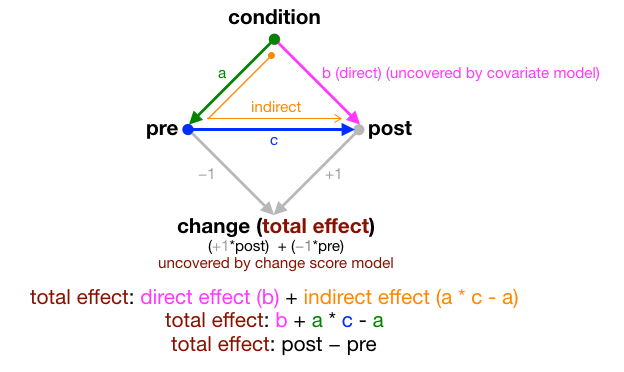
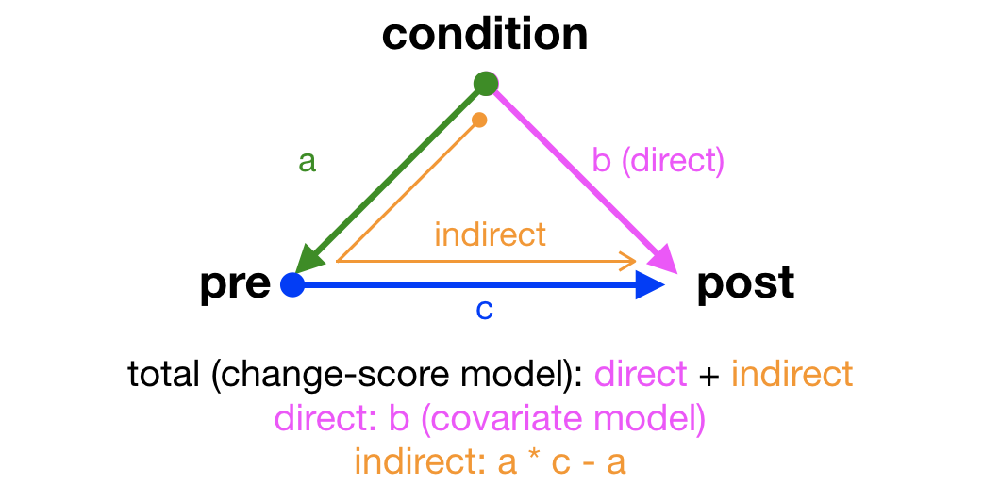
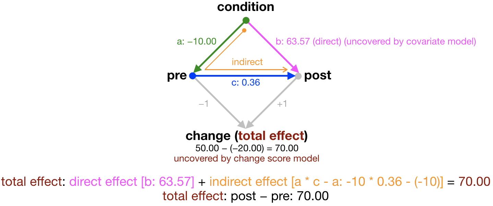

```{r setup, include=FALSE}
knitr::opts_chunk$set(echo = TRUE, cache = FALSE, comment = NA, message = FALSE, warning = FALSE)
```

Get source code for this RMarkdown script [here](https://raw.githubusercontent.com/hauselin/rtutorialsite/master/_posts/2020-04-11-causal-inference-and-lords-paradox-change-score-or-covariate/causal-inference-and-lords-paradox-change-score-or-covariate.Rmd).

## Consider being a patron and supporting my work?

[Donate and become a patron](https://donorbox.org/support-my-teaching): If you find value in what I do and have learned something from my site, please consider becoming a patron. It takes me many hours to research, learn, and put together tutorials. Your support really matters.


```{r}
# load libraries for analyses
library(data.table); library(lavaan)
```

## Lord's Paradox

Here's a common study for scientific studies: Participants are randomly assigned to either receive a **drug or a placebo (control condition)**. To evaluate the effects of the treatment (drug vs placebo control), you measure participants on some outcome measure **before (pre-intervention)** and **after the intervention (post-intervention)**. 


## How should we analyze the data?

1. **Change-score approach**: You can subtract the pre score from the post score `post - pre` and fit a model to this difference or change score. That is, a t-test or linear regression that compares change scores between the drug and control conditions. 

* This difference/change-score model gives the **total effect of condition** (total effect: direct + indirect effects).

2. **Covariate approach**: Or you can adjust for the effect of pre score (baseline) by including it as a covariate in your model. That is, you fit an ANCOVA or linear regression that models post score as a function of condition and post score (covariate). 

* This covariate model gives you the **direct effect of condition**.

These two approaches often lead to different results, and is known as **Lord's Paradox**. Judea Pearl[@Pearl] explains this paradox very well and has "resolved" this paradox by showing that both approaches are correct, but they uncover different effects or paths in the causal diagram. 

Let's play with fake data to understand this paradox.

## Create fake data

Experimental design: 2 experimental conditions (drug vs control) (`condition`); 6 subjects (3 per condition) (`id`); measure of pre-experiment score (`pre`); measure of post-experiment score (`post`)

```{r}
dt1 <- data.table(id = c(1, 2, 3, 4, 5, 6), # subject ids
           condition = factor(rep(c("drug", "control"), each = 3)), # between-subjects intervention
           pre = c(10, 20, 40, 20, 50, 30), # pre score (baseline)
           post = c(70, 60, 90, 10, 10, 20) # post score
           )
dt1[, change := post - pre]  # compute change score
dt1
```

```{r, echo=FALSE, eval=FALSE, results='hide'}
dt1 <- data.table(id = c(1, 2, 3, 4, 5, 6), # subject ids
           condition = factor(rep(c("drug", "control"), each = 3)), # between-subjects intervention
           pre = c(10, 20, 40, 10, 20, 40), # pre score (baseline)
           post = c(70, 60, 90, 10, 10, 20) # post score
           )
dt1[, change := post - pre]  # compute change score
dt1
```

Mean change score for each condition:

```{r}
dt1[, .(change_group_mean = mean(change)), by = condition]
```

Clearly the drug intervention is super effective.


## Draw causal diagram

We can draw a directed acyclic graph (DAG) to represent our experimental design. DAGs are super useful for drawing inferences and making clear the paths and assumptions in our models and experimental designs. This figure is adapted from Pearl's paper[@Pearl].



There are three path coefficients to be estimated in this DAG: `a`, `b`, and `c`. 

* `c`: the relationship (blue) between `pre` and `post`, which can be estimated using the covariate approach

* `b`: is the direct effect (pink) of condition on `post`, which can also be estimated using the covariate approach

* `a`: we don't expect our intervention to affect `pre`, but it's needed in the model to evaluate the indirect effect (orange) of `condition` on `post`; think of it as the effect of drug/control treatment (`condition`) will have different effects on the outcome (`post`), depending on people's baselines (`pre`)

Other effects that can be computed from these three coefficients:

* `total effect`: direct (pink) + indirect effect (orange); which is also the change score that can be obtained using the change-score approach; also equivalent to `+1 * post -1 * pre`

* indirect effect: `a * c - a`, which captures the indirect effect of `condition` on `post` while subtracting effect of `condition` on `pre` (i.e., path `a`)

Important observations

* If path `a` or `c` is 0, then the indirect path of `condition` on `post` via `pre` must be 0. Path `a` can be 0 if we have *perfect* experimental control via *perfect* random assignment (which never happens in real life)—when participants in the two different experimental conditions have exactly the same `pre` scores. In that case, all effects of `condition` will be direct (via path `b`). You can change the fake data above to test the effects of the two conditions having the same `pre` scores.

## Causal inference via structural equation model (SEM)

Define causal diagram using structural equation model syntax in lavaan package. The details of how to specify the DAG above in lavaan aren't important here. 



I specify two regression models (see comments in below). I'm telling lavaan to estimate three path coefficients for me `a`, `b`, and `c`, and then deterine other path coefficients (total, direct, indirect) based on these three coefficients.

```{r}
model <-" 
# regression 1
pre ~ a * condition
# a: lm(pre ~ condition) # condition effect

# regression 2
post ~ b * condition + c * pre
# b: lm(post ~ condition + pre, dt1) # condition effect on post (adjust for pre ;ANCOVA)
# c: lm(post ~ condition + pre, dt1) # pre effect on post (adjust for condition; ANCOVA)

# define parameters to understand DAG, covariate/change-score
total := b + a * c - a  
# total: lm(change ~ condition, dt1) # condition effect on change score (total effect)
direct := b
indirect := a * c - a  # or total - direct
"
```

## Fit the SEM or DAG using lavaan's `sem` function

```{r}
sem_results <- sem(model, dt1)
```

```{r, echo=FALSE, results='hide'}
sem_df <- summary(sem_results)$PE[c(1, 2, 3, 7, 8, 9), c(1, 3, 4, 6)]
setDT(sem_df)
sem_df$est <- round(sem_df$est, 2)
names(sem_df)[1:3] <- c("outcome", "effect", "effect_label")
sem_df$desc <- ""
sem_df$desc[1] <- "lm(pre ~ condition)"
sem_df$desc[2] <- "lm(post ~ condition + pre)"
sem_df$desc[3] <- "lm(post ~ condition + pre)"
sem_df$desc[4] <- "lm(change ~ condition)"
sem_df$desc[5] <- "same as line 2 above"
sem_df$desc[6] <- "total-direct"
```

## Interpret model results

lavaan's model output contains a lot of information that isn't necessary for this tutorial, so I've summarized the main path coefficients we care about below. 

```{r, echo=FALSE}
sem_df
```

Rows 1 to 3 contain the estimated path coefficients `a`, `b`, `c` estimated using structural equation modeling (SEM). The last column `desc` tells you the regression model (e.g., covariate model or change-score model) to obtain that coefficient (which I'll show below). 

Note that the estimated total effect `b + a * c - a` is in fact the difference in mean change between the two conditions (70). The total effect, which is the difference in change score between the two conditions, is the sum of the direct and indirect effects.

**Conclusion**: The DAG and SEM contain all the information of covariate and change-score models!

## Compare results with covariate and change-score models

Let's fit the covariate model and change-score linear regression models to see how the results form these models map on to the results obtained using SEM.



Path `a` is the model we don't typically fit. It captures the **effect of `condition` on `pre` score**.

```{r}
path_a <- lm(pre ~ condition, dt1) # path a
round(coef(path_a)[-1], 2) # see row 1 of table above
```

Paths `b` and `c` are captured by the **covariate model**. It captures the **direct effect of `condition` on `post` score after adjusting for `pre` score** (and also effect of `pre` on `post` after adjusting for `condition`).

```{r}
paths_bc <- lm(post ~ condition + pre, dt1) # paths b (condition) and c (pre)
round(coef(paths_bc)[-1], 2) # see rows 2, 3, and 5 of table above
```

The **change-score model** captures the total effect (the **effect of `condition` on the change or difference score**).

```{r}
total <- lm(change ~ condition, dt1) # total effect (change score): b + a * c - a  
round(coef(total)[-1], 2) # see row 4 of table above
```

## Resources

If you want to learn more, read Pearl's[@Pearl] paper and check out the resources below by [Michael Clark](https://m-clark.github.io/).

* [Lord's Paradox](https://m-clark.github.io/docs/lord/index.html)
* [Repeated measures and mixed models](https://m-clark.github.io/docs/mixedModels/anovamixed.html)

## Support my work

[Support my work and become a patron here](https://donorbox.org/support-my-teaching)!
