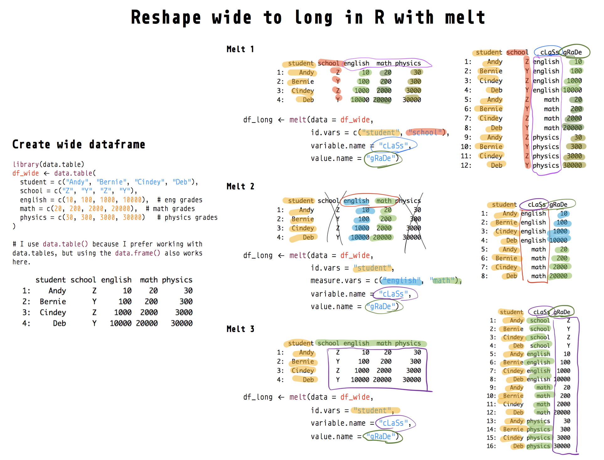
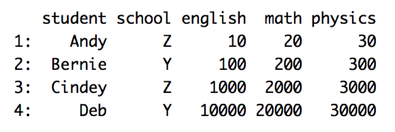
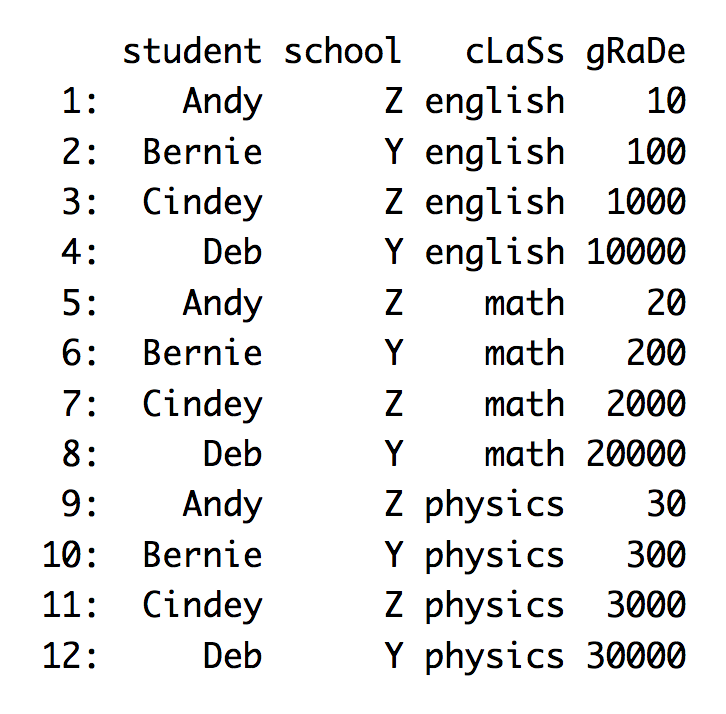
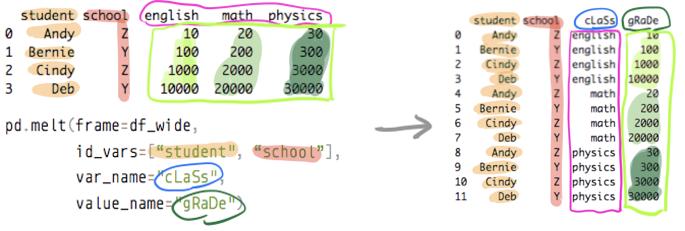
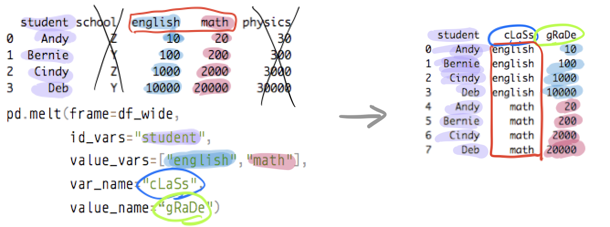
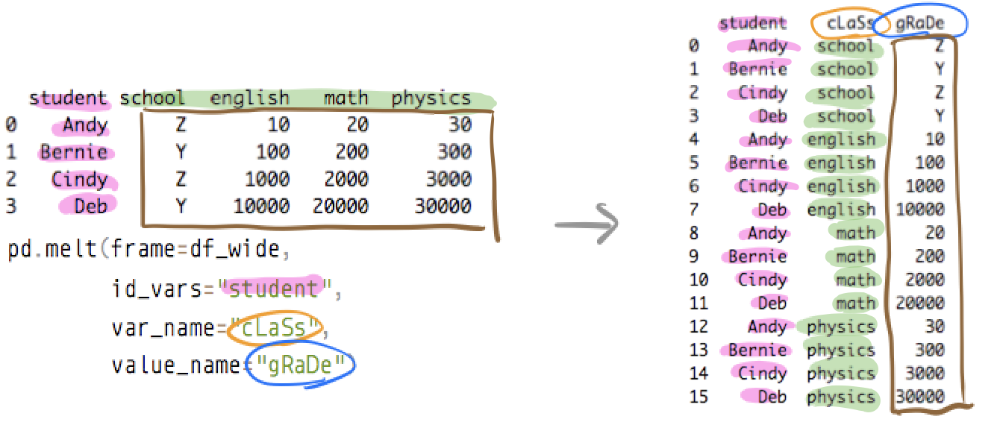

```{r setup, include=FALSE}
knitr::opts_chunk$set(echo = TRUE, cache = FALSE, comment = NA, message = FALSE, warning = FALSE)
```

Get source code for this RMarkdown script [here](https://raw.githubusercontent.com/hauselin/rtutorialsite/master/_posts/2020-05-17-reshape-python-pandas-dataframe-from-long-to-wide-with-pivottable/reshape-python-pandas-dataframe-from-long-to-wide-with-pivottable.Rmd).

This Python tutorial is on [Medium, Towards Data Science](https://towardsdatascience.com/reshape-pandas-dataframe-with-melt-in-python-tutorial-and-visualization-29ec1450bb02). Click here if you're looking for the tutorial for the R version of melt (also the `melt` function in R).

## Consider being a patron and supporting my work?

[Donate and become a patron](https://donorbox.org/support-my-teaching): If you find value in what I do and have learned something from my site, please consider becoming a patron. It takes me many hours to research, learn, and put together tutorials. Your support really matters.

How does the pandas `melt()` method reshape dataframes? How do you reshape a dataframe from wide to long form? This tutorial will walk you through reshaping dataframes using `pd.melt()` or the `melt` method associated with pandas dataframes.



Also, you might want to check out the official pandas documentation and my [numpy reshape tutorial](https://towardsdatascience.com/reshaping-numpy-arrays-in-python-a-step-by-step-pictorial-tutorial-aed5f471cf0b?source=friends_link&sk=3dc229066e89cb5bcd4bb86b301f0a5c).

Let's load the `reticulate` library in R so we can run Python in RStudio. I'll then load my conda python environment. I highly recommend you try the code in Python while you read this article. Try running this tutorial on my shared [DeepNote notebook](https://beta.deepnote.com/project/d1350ad6-bcb4-4c3d-857b-c29d01b8a803) (you can only run but not edit this notebook).

```{r}
library(reticulate)
# load conda python environment
use_condaenv(condaenv = "python376", conda = "/opt/anaconda3/bin/conda")
```

```{python}
import pandas as pd
```

## Wide data

It’s easiest to understand what a **wide** dataframe is or looks like if we look at one and compare it with a long dataframe.

<div style="width:300px">

</div>

And below is the corresponding dataframe (with the same information) but in the **long** form:

<div style="width:300px">

</div>

Before we begin our `pd.melt` tutorial, let’s recreate the wide dataframe above in Python with `pd.DataFrame`.

```{python}
df_wide = pd.DataFrame(
  {"student": ["Andy", "Bernie", "Cindy", "Deb"],
   "school":  ["Z", "Y", "Z", "Y"],
   "english": [10, 100, 1000, 10000],  # eng grades
   "math":    [20, 200, 2000, 20000],  # math grades
   "physics": [30, 300, 3000, 30000]   # physics grades
  }
)
df_wide
```

## Wide to long with `melt`

Common terms for this transformation are melt, unpivot, gather, stack. See `pd.melt()` documentation [here](https://pandas.pydata.org/docs/reference/api/pandas.melt.html).

### Melt example 1

We melt the dataframe by specifying the identifier columns via `id_vars`. The “leftover” non-identifier columns (english, math, physics) will be melted or stacked onto each other into one column.

A new indicator column will be created (contains values english, math, physics) and we can rename this new column (cLaSs) via `var_name`. We can also rename the column in which all the actual grades are contained (gRaDe) via `value_name`.

```{python}
pd.melt(frame=df_wide, 
        id_vars=["student", "school"], 
        var_name="cLaSs", 
        value_name="gRaDe")

# or you can use the melt method associated with a dataframe
# df_wide.melt(id_vars=["student", "school"], var_name="cLaSs", value_name="gRaDe")
```



### Melt example 2

You can use `value_vars` to specify which columns you want to melt or stack into column (here, we exclude physics column, so `value_vars=["english", "math"]`). We also drop the school column from `id_vars`.

```{python}
pd.melt(frame=df_wide, 
  id_vars="student", 
  value_vars=["english","math"], 
  var_name="cLaSs", 
  value_name="gRaDe")

# or you can use the melt method associated with a dataframe
# df_wide.melt(id_vars="student", value_vars=["english","math"], var_name="cLaSs", value_name="gRaDe")
```



### Melt example 3

Finally, let’s see what happens if we specify only the student column as the identifier column (`id_vars="student"`) but do not specify which columns you want to stack via `value_vars`. As a result, all non-identifier columns (school, english, math, physics) will be stacked into one column.

The resulting long dataframe looks wrong because now the cLaSs and gRaDe columns contain values that shouldn’t be there. The point here is to show you how `pd.melt` works.

```{python}
pd.melt(frame=df_wide,
        id_vars="student",
        var_name="cLaSs", 
        value_name="gRaDe")

# or you can use the melt method associated with a dataframe
# df_wide.melt(id_vars="student", var_name="cLaSs", value_name="gRaDe")
```

This table looks wrong because the `school` column in `df_wide` doesn't belong—`school` should be another identifier column (see Melt 1 above).



## Support my work

I hope now you have a better understanding of how `pd.melt` reshapes dataframes. If you find this post useful, check out my other articles and follow me on [Medium ](https://medium.com/@ausius).

If you've enjoyed my article, [support my work and become a patron here](https://donorbox.org/support-my-teaching)!
