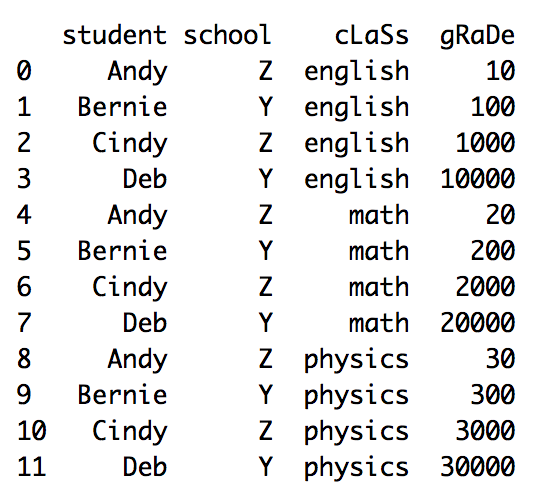
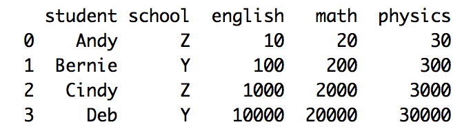

```{r setup, include=FALSE}
knitr::opts_chunk$set(echo = TRUE, cache = FALSE, comment = NA, message = FALSE, warning = FALSE)
```

Get source code for this RMarkdown script [here](https://raw.githubusercontent.com/hauselin/rtutorialsite/master/_posts/2020-05-14-reshaping-data-in-python-pandas/reshaping-data-in-python-pandas.Rmd).

This Python tutorial is also available on [Medium, Towards Data Science](https://towardsdatascience.com/reshape-pandas-dataframe-with-melt-in-python-tutorial-and-visualization-29ec1450bb02). Click here if you're looking for the R version of melt (also the `dcast` function in R).

## Consider being a patron and supporting my work?

[Donate and become a patron](https://donorbox.org/support-my-teaching): If you find value in what I do and have learned something from my site, please consider becoming a patron. It takes me many hours to research, learn, and put together tutorials. Your support really matters.

How does the pandas `pivot_table()` method reshape dataframes? How do you reshape a dataframe from wide to long form? This tutorial will walk you through reshaping dataframes using `pd.pivot_table()` or the `pivot_table` method associated with pandas dataframes.



Also, you might want to check out the official pandas documentation and my [numpy reshape tutorial](https://towardsdatascience.com/reshape-pandas-dataframe-with-melt-in-python-tutorial-and-visualization-29ec1450bb02).

Let's load the `reticulate` library in R so we can run Python in RStudio. I'll then load my conda python environment. I highly recommend you try the code in Python while you read this article. Try running this tutorial on my shared [DeepNote notebook](https://beta.deepnote.com/project/b494e5b7-9e5c-4e06-8a4a-43130d27aa3f) (you can only run but not edit this notebook).

```{r}
library(reticulate)
# load conda python environment
use_condaenv(condaenv = "python376", conda = "/opt/anaconda3/bin/conda")
```

```{python}
import pandas as pd
```

## Long data

It’s easiest to understand what a **long** dataframe is or looks like if we look at one and compare it with a wide dataframe.

<div style="width:300px">

</div>

And below is the corresponding dataframe (with the same information) but in the **long** form:

<div style="width:300px">

</div>

Before we begin our `pd.pivot_table` tutorial, let’s recreate the long dataframe above in Python with `pd.DataFrame`.

```{python}
df_long = pd.DataFrame(
  {"student": ["Andy", "Bernie", "Cindy", "Deb", "Andy", "Bernie", "Cindy", "Deb", "Andy", "Bernie", "Cindy", "Deb"],
   "school":  ["Z", "Y", "Z", "Y", "Z", "Y", "Z", "Y", "Z", "Y", "Z", "Y"],
   "class":   ["english", "english", "english", "english", "math", "math", "math", "math", "physics", "physics", "physics", "physics"],
   "grade":   [10, 100, 1000, 10000, 20, 200, 2000, 20000, 30, 300, 3000, 30000]
  }
)
df_long
```


## Long to wide with `pivot_table`

Common terms for this transformation are pivot, spread, dcast. See `pd.pivot_table()` documentation [here](https://pandas.pydata.org/pandas-docs/stable/reference/api/pandas.pivot_table.html).

We'll use the `pivot_table` method because it's very flexible relative to the `pivot` method (which I won't explain here since `pivot_table` does everything `pivot` can do).

### Pivot Example 1

Pivot the dataframe by specifying only the index:

```{python}
df_long.pivot_table(index=["student", "school"])
```


```{python}
# same as above
df_long.pivot_table(index=["student", "school"], aggfunc='mean') 
```

```{python}
df_long.pivot_table(index=["student", "school"], aggfunc='sum').reset_index()
```


```{python}
df_long.pivot_table(index=["student", "school"]).reset_index()
```

```{python}
df_long.pivot_table(index=["student", "school"], aggfunc='max').reset_index()
```

```{python}
df_long.pivot_table(index=["student", "school"], aggfunc=['sum', 'last', 'min']).reset_index()
```

```{python}
df_long.pivot_table(index=["student", "school"], columns='class', values='grade').reset_index()
```

```{python}
df_long.pivot_table(index=["student", "school"], columns='class', values='grade', margins=True).reset_index()
```

```{python}
df_long.pivot_table(index="student", columns=['school', 'class'], values='grade').reset_index()
```

```{python}
df_long.pivot_table(index="student", columns=['school', 'class'], values='grade', fill_value=-5)
```


## Resources

https://pbpython.com/pandas-pivot-table-explained.html

https://pandas.pydata.org/pandas-docs/stable/user_guide/reshaping.html

https://chrisalbon.com/python/data_wrangling/pandas_pivot_tables/

https://stackoverflow.com/questions/22798934/pandas-long-to-wide-reshape-by-two-variables

## Support my work

I hope now you have a better understanding of how `pd.pivot_table` reshapes dataframes. If you find this post useful, check out my other articles and visit my [Medium page](https://medium.com/@ausius).

If you've enjoyed my article, [support my work and become a patron here](https://donorbox.org/support-my-teaching)!
