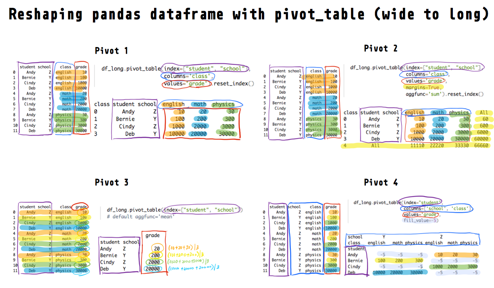
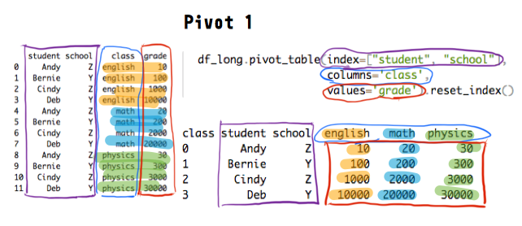
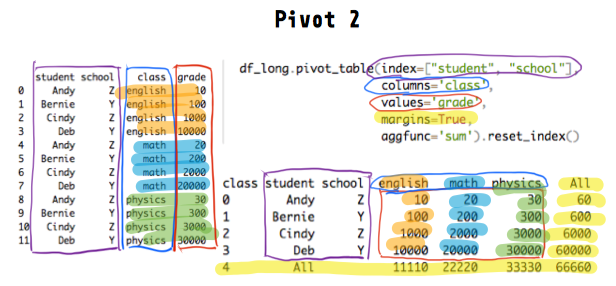
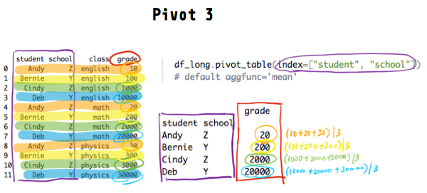
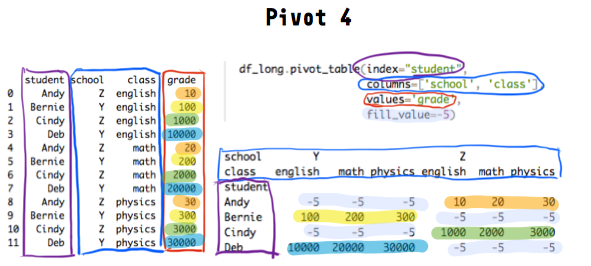

```{r setup, include=FALSE}
knitr::opts_chunk$set(echo = TRUE, cache = FALSE, comment = NA, message = FALSE, warning = FALSE)
```

Get source code for this RMarkdown script [here](https://raw.githubusercontent.com/hauselin/rtutorialsite/master/_posts/2020-05-17-reshape-python-pandas-dataframe-from-long-to-wide-with-pivottable/reshape-python-pandas-dataframe-from-long-to-wide-with-pivottable.Rmd).

This Python tutorial is also on [Medium, Towards Data Science](https://towardsdatascience.com/reshape-pandas-dataframe-with-pivot-table-in-python-tutorial-and-visualization-2248c2012a31). Click here if you're looking for the tutorial for the R version of `pivot_table` (also the `dcast` function in R).

The opposite of `pivot_table` is `melt`, and you can find the tutorial for `melt` (wide to long) [here](https://towardsdatascience.com/reshape-pandas-dataframe-with-melt-in-python-tutorial-and-visualization-29ec1450bb02).

## Consider being a patron and supporting my work?

[Donate and become a patron](https://donorbox.org/support-my-teaching): If you find value in what I do and have learned something from my site, please consider becoming a patron. It takes me many hours to research, learn, and put together tutorials. Your support really matters.

How does the pandas `pivot_table()` method reshape dataframes? How do you reshape a dataframe from long to wide form? This tutorial will walk you through reshaping dataframes using `pd.pivot_table()` or the `pivot_table` method associated with pandas dataframes.



Also, you might want to check out the official pandas documentation and my [numpy reshape tutorial](https://towardsdatascience.com/reshaping-numpy-arrays-in-python-a-step-by-step-pictorial-tutorial-aed5f471cf0b?source=friends_link&sk=3dc229066e89cb5bcd4bb86b301f0a5c).

Let's load the `reticulate` library in R so we can run Python in RStudio. I'll then load my conda python environment. I highly recommend you try the code in Python while you read this article. Try running this tutorial on my shared [DeepNote notebook](https://beta.deepnote.com/project/b494e5b7-9e5c-4e06-8a4a-43130d27aa3f) (you can only run but not edit this notebook).

```{r}
library(reticulate)
# load conda python environment
use_condaenv(condaenv = "python376", conda = "/opt/anaconda3/bin/conda")
```

```{python}
import pandas as pd
```

## Long data

It’s easiest to understand what a **long** dataframe is or looks like if we look at one and compare it with a wide dataframe.

<div style="width:300px">

</div>

And below is the corresponding dataframe (with the same information) but in the **wide** form:

<div style="width:300px">

</div>

Before we begin our `pd.pivot_table` tutorial, let’s recreate the long dataframe above in Python with `pd.DataFrame`.

```{python}
df_long = pd.DataFrame({
        "student":
            ["Andy", "Bernie", "Cindy", "Deb",
             "Andy", "Bernie", "Cindy", "Deb",
             "Andy", "Bernie", "Cindy", "Deb"],
        "school":
            ["Z", "Y", "Z", "Y",
             "Z", "Y", "Z", "Y",
             "Z", "Y", "Z", "Y"],
        "class":
            ["english", "english", "english", "english",
             "math", "math", "math", "math",
             "physics", "physics", "physics", "physics"],
        "grade":
            [10, 100, 1000, 10000,
             20, 200, 2000, 20000,
             30, 300, 3000, 30000]
        
})
df_long
```


## Long to wide with `pivot_table`

Common terms for this transformation are pivot, spread, dcast. See `pd.pivot_table()` documentation [here](https://pandas.pydata.org/pandas-docs/stable/reference/api/pandas.pivot_table.html).

We'll use the `pivot_table` method because it's very flexible relative to the `pivot` method (which I won't explain here since `pivot_table` does everything `pivot` can do).

### Pivot example 1

We often want to keep the identifier columns as they are (`index=["student", "school"]`) but pivot or "split" a column's values (`values='grade'`) based on another column (`columns='class'`). Compare the original and pivoted dataframes below and you'll understand what that means.

Each unique value in the class column will be a new column (english, math, physics) in the pivoted/wide dataframe. We can also provide a list to the `columns` parameter.

```{python}
df_long.pivot_table(index=["student", "school"], 
                    columns='class', 
                    values='grade')
```

To get rid of the multi-index, use `.reset_index()`

```{python}
df_long.pivot_table(index=["student", "school"], 
                    columns='class', 
                    values='grade').reset_index()
```



### Pivot example 2

You can also aggregate each resulting row and column by specifying `margins=True` (default `False`). 

The example below aggregates by computing the sum via `aggfunc='sum'` (default `'mean'`) and there are many other aggregation functions you can use (e.g., `'median'`, `'sum'`, `'max'`). You can also specify multiple functions as a list (e.g., `aggfunc=['mean', 'sum']`)

```{python}
df_long.pivot_table(index=["student", "school"], 
                    columns='class', 
                    values='grade',
                    margins=True,
                    aggfunc='sum').reset_index()
```



### Pivot example 3

If we don't specify any columns via `columns`, **all** remaining non-identifier **numeric** columns (only grade in this dataframe) will be pivoted (long to wide).

```{python}
df_long.pivot_table(index=["student", "school"]) 
# default aggfunc='mean'
```

In the original long data, each student has **four** grades (english, math, physics), yet in the `pivot_table` example above, each student only has **one** grade after pivoting. 

Why and how does it work? If you remember from the example above, the default is `aggfunc='mean'`. Thus, what the function did was it grouped the data by student and school (via `index=["student", "school"]`), and computed the mean value for each group. 



If you use the `groupby` method associated with the pandas dataframe, you will get the same result as above.

```{python}
df_long.groupby(['student', 'school']).mean()
```

If you change the default aggregation function (e.g., `aggfunc='max'`), you'll get different results. The examples below show you how to specify different aggregation functions and also show you how `groupby` can be used to perform the same pivot.

Note that you'll also see the class that is associated with each 'max' and 'first' value.

```{python}
df_long.pivot_table(index=["student", "school"], 
                    aggfunc=['max', 'first'])

df_long.groupby(["student", "school"]).agg(['max', 'first'])
```

### Pivot example 4

The final example shows you what happens when you pivot multiple columns (`columns=['school', 'class']`) and you can deal with missing values after pivoting. 

Here we're saying, for each student (`index="student"`), split their grades (`values=grade`) into separate columns, based on their school and class (`columns=['school', 'class']`). 

```{python}
df_long.pivot_table(index="student", 
                    columns=['school', 'class'], 
                    values='grade')
```

The `NaN` values are expected because each student belongs to only one school (Y or Z). For example, Andy is in school Z and therefore doesn't have grades in the Y columns.

We can replace the `NaN` values with another value (-5 in the example below).

```{python}
df_long.pivot_table(index="student", 
                    columns=['school', 'class'], 
                    values='grade', 
                    fill_value=-5)
```



## Resources

* [Pandas official reshaping documentation](https://pandas.pydata.org/pandas-docs/stable/user_guide/reshaping.html)
* [Excellent stackoverflow responses](https://stackoverflow.com/questions/22798934/pandas-long-to-wide-reshape-by-two-variables)
* [Chris Albon's pivot_table examples](https://chrisalbon.com/python/data_wrangling/pandas_pivot_tables/)
* [Practical Business Python's pivot_table tutorial](https://pbpython.com/pandas-pivot-table-explained.html)

## Support my work

I hope now you have a better understanding of how `pd.pivot_table` reshapes dataframes. If you find this post useful, check out my other articles and follow me on [Medium ](https://medium.com/@ausius).

If you've enjoyed my article, [support my work and become a patron here](https://donorbox.org/support-my-teaching)!
