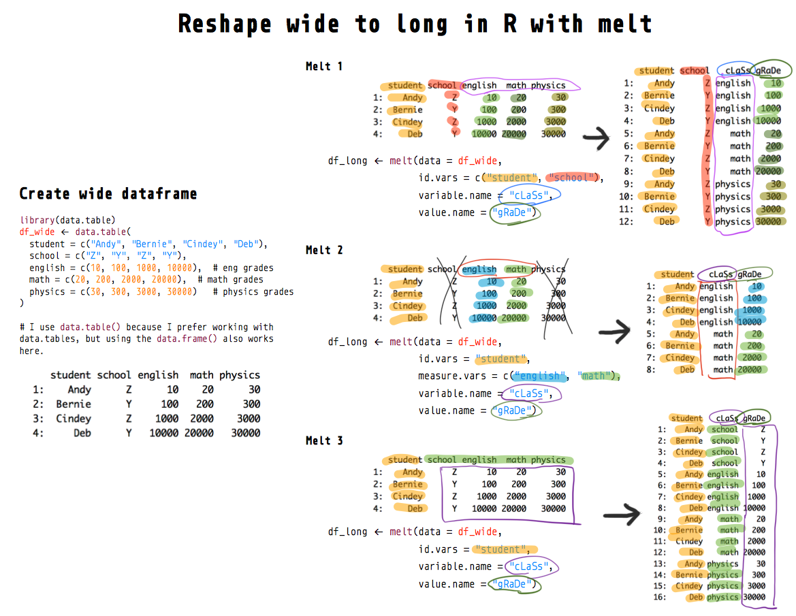
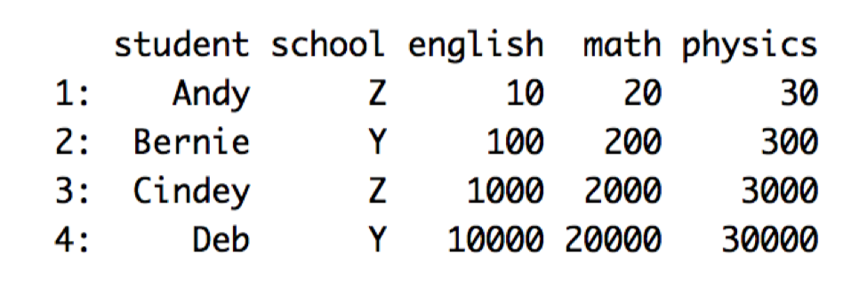
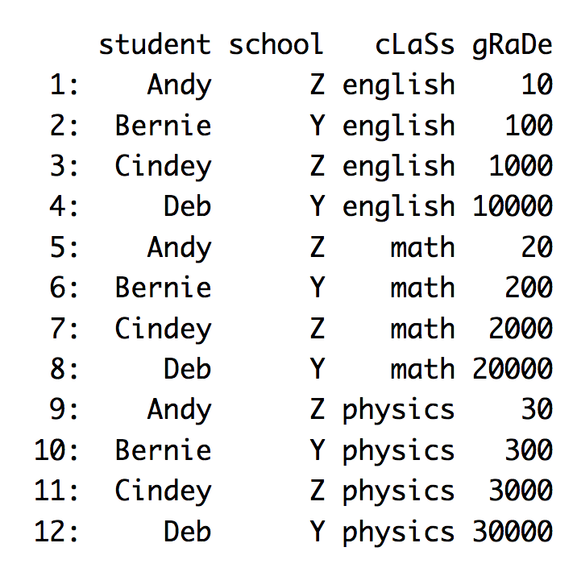
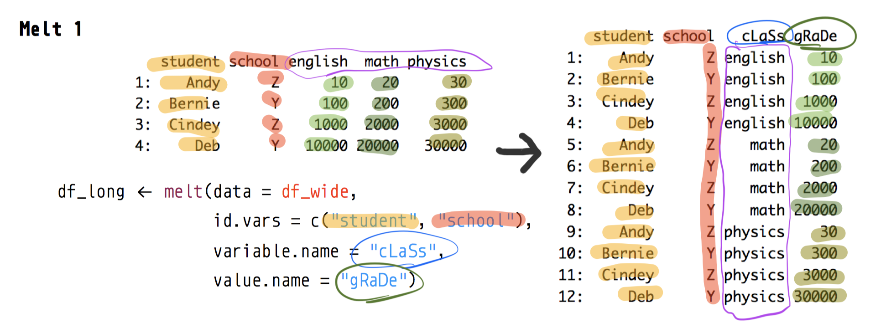
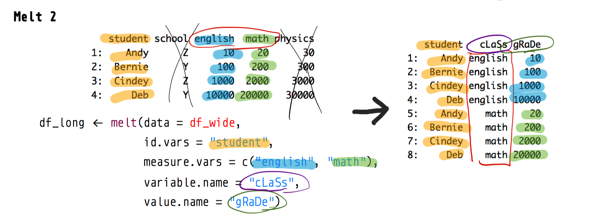
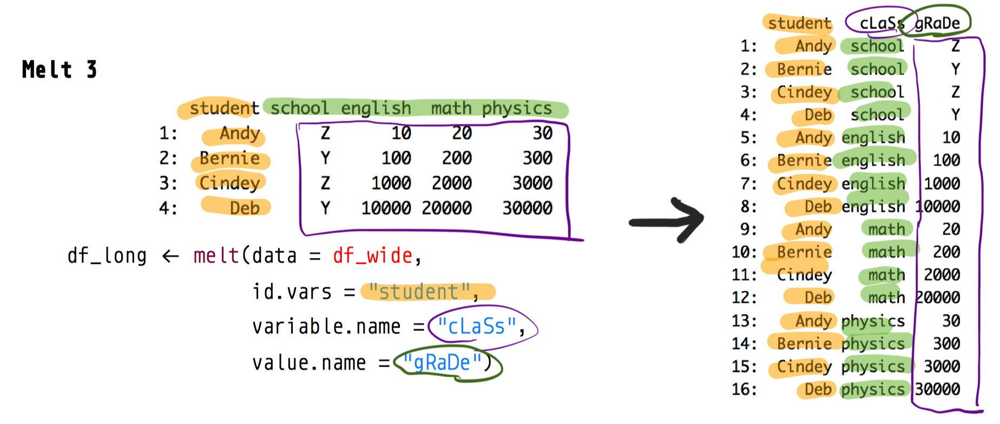

```{r setup, include=FALSE}
knitr::opts_chunk$set(echo = TRUE, cache = FALSE, comment = NA, message = FALSE, warning = FALSE)
```

Get source code for this RMarkdown script [here](https://raw.githubusercontent.com/hauselin/rtutorialsite/master/_posts/2020-06-27-reshape-r-dataframes-from-wide-to-long-with-melt/reshape-r-dataframes-from-wide-to-long-with-melt.Rmd).

## Consider being a patron and supporting my work?

[Donate and become a patron](https://donorbox.org/support-my-teaching): If you find value in what I do and have learned something from my site, please consider becoming a patron. It takes me many hours to research, learn, and put together tutorials. Your support really matters.

How do you reshape a dataframe from wide to long form in R? How does the `melt()` function reshape dataframes in R? This tutorial will walk you through reshaping dataframes using the `melt` function.



Common terms for this transformation are melt, pivot-long, unpivot, gather, stack. Many functions have been written to convert data from wide to long form, but I believe `melt()` from the `data.table` library is the best. See `melt()` documentation [here](https://cran.r-project.org/web/packages/data.table/vignettes/datatable-reshape.html). 

* other functions like `gather` and `pivot_longer` are often just wrapper functions for `melt()`—these other functions simplify `melt` and often can't deal with more complex transformations
* `melt` is more powerful but isn't any more complicated than the other functions...
* `melt` alone is often enough for all your wide-to-long transformations; don't need to learn `gather`, `pivot_longer`, and `melt`; `melt` alone is enough!
* Python's [pandas](https://pandas.pydata.org/pandas-docs/stable/reference/api/pandas.melt.html) library also has the equivalent `melt` function/method that works the same way (see my pandas melt tutorial [here](https://towardsdatascience.com/reshape-pandas-dataframe-with-melt-in-python-tutorial-and-visualization-29ec1450bb02))
* `data.table` package's implementation of `melt`, which is extremely powerful—much more efficient and powerful than the reshape library's `melt` function. According to the [documentation](https://cran.r-project.org/web/packages/data.table/vignettes/datatable-reshape.html): 

> The melt and dcast functions for data.tables are for reshaping wide-to-long and long-to-wide, respectively; the implementations are specifically designed with large in-memory data (e.g. 10Gb) in mind.

Reminder again: We're using `melt` from the `data.table` library, not `reshape` library! Compare the documentation of the `melt` functions from the two libraries to the differences: `?data.table::melt` and `?reshape::melt`

```{r}
# load data.table library so we use its melt implementation
library(data.table)
```

## Wide data

It’s easiest to understand what a **wide** dataframe is or looks like if we look at one and compare it with a long dataframe.

<div style="width:300px">

</div>

And below is the corresponding dataframe (with the same information) but in the **long** form:

<div style="width:300px">

</div>

Before we begin our `melt` tutorial, let’s recreate the wide dataframe above. 

```{r}
df_wide <- data.table(
  student = c("Andy", "Bernie", "Cindey", "Deb"),
  school = c("Z", "Y", "Z", "Y"),
  english = c(10, 100, 1000, 10000),  # eng grades
  math = c(20, 200, 2000, 20000),  # math grades
  physics = c(30, 300, 3000, 30000)   # physics grades
)
df_wide
```

Note that I like to use `data.tables` instead of `data.frames` because `data.tables` are much more powerful. If you data isn't a data.table (check by running `class(your_dataframe)` in your console), I highly recommend you convert it to a `data.table`.

```{r}
class(df_wide) # data.table and data.frame
```

Simply load the `data.table` library and use the `setDT` function to convert any dataframe to `data.table`

```{r}
setDT(df_wide) # no reassignment required! no need to write df_wide <- setDT(df_wide)
```

## Wide to long with `melt`

### Melt example 1

We melt by specifying the identifier columns via `id.vars`. The “leftover” non-identifier columns (english, math, physics) will be melted or stacked onto each other into one column.

A new indicator column will be created (contains values english, math, physics) and we can rename this new column (cLaSs) via `variable.name`. We can also rename the column in which all the actual grades are contained (gRaDe) via `value.name`.

```{r}
df_long <- melt(data = df_wide, 
                id.vars = c("student", "school"),
                variable.name = "cLaSs",
                value.name = "gRaDe")
df_long
```



### Melt example 2

You can use `measure.vars` to specify which columns you want to melt or stack into column (here, we exclude physics column, so `measure.vars = c("english", "math")`). We also drop the school column from `id.vars`.

```{r}
df_long <- melt(data = df_wide, 
                id.vars = "student",
                measure.vars = c("english", "math"),
                variable.name = "cLaSs",
                value.name = "gRaDe")
df_long
```



### Melt example 3

Finally, let’s see what happens if we specify only the student column as the identifier column (`id.vars = "student"`) but do not specify which columns you want to stack via `measure.vars`. As a result, all non-identifier columns (school, english, math, physics) will be stacked into one column.

The resulting long dataframe looks wrong because now the cLaSs and gRaDe columns contain values that shouldn’t be there. The point here is to show you how `melt` works.

```{r}
df_long <- melt(data = df_wide,
                id.vars = "student",
                variable.name = "cLaSs",
                value.name = "gRaDe")
df_long
```

This table looks wrong because the `school` column in `df_wide` doesn't belong—`school` should be another identifier column (see Melt 1 above). The melt function also  also returned a warning message that tells you your column (`gRaDe`) have values of different types (i.e., character and numeric).



## Support my work

I hope now you have a better understanding of how `melt` performs wide-to-long transformations If you find this post useful, check out my other articles and follow me on [Medium ](https://medium.com/@ausius).

If you've enjoyed my article, [support my work and become a patron here](https://donorbox.org/support-my-teaching)!
